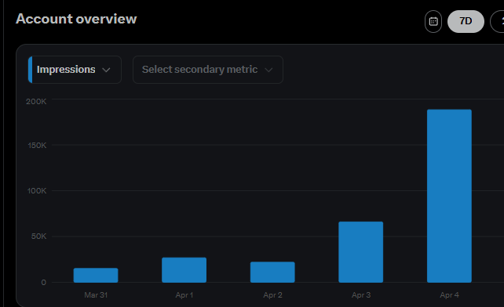

# Clearfeed


Find high-signal X posts, draft better replies in your own voice, and stay in the conversation without living in the feed.

Clearfeed is a local-first X/Twitter dashboard for builders, founders, operators, and researchers who want better inputs before they write. It watches your weighted X Lists and optional home timeline, ranks the posts worth attention, and helps you draft replies, quote replies, and original posts while you stay in control.

It runs locally, supports Google Vertex and OpenAI-compatible endpoints, and keeps posting manual by design.

## Why Clearfeed

- Cut through feed noise with weighted list-based discovery.
- Find reply opportunities faster instead of checking X all day.
- Draft in your own voice using local profile files like `WhoAmI.md`, `Voice.md`, and `Humanizer.md`.
- Improve future drafts from the edits, rewrites, and rejections you make in the dashboard.
- Keep your workflow, profile context, and review history on your own machine.

## What Makes It Different

- Clearfeed optimizes for signal first, not just more AI output.
- You stay in the loop. Every post is reviewed, edited, copied, and posted manually.
- Adaptive Voice can propose improvements to `Voice.md` based on your real decisions over time.
- You can use hosted models or local OpenAI-compatible servers like Ollama, LM Studio, and vLLM.

## See The Workflow

### Full Dashboard Tour

One pass through the local workflow, from ranked posts to reply drafting, original post generation, and Adaptive Voice review.


### Generate A Reply From A Tweet Link

Pull a tweet into the queue, generate a draft, and decide what to keep without posting anything automatically.


### Draft An Original Post

Write a brief, generate standalone post options, and keep the ones worth publishing.


### Improve Voice With Real Feedback

Review Adaptive Voice suggestions before applying any changes to your voice file.


## Who This Is For

- People who actively post on X and want better reply opportunities.
- Builders and founders who track specific lists, niches, or communities.
- Operators and researchers who want AI help with drafting, not autopilot posting.
- Anyone who wants to learn from the right posts without getting stuck in the timeline.

## How It Works

1. Add the X Lists you care about and give each source a weight.
2. Run the worker to pull recent posts and rank the strongest candidates.
3. Review the best posts in the local dashboard.
4. Generate a reply, quote reply, or original post draft in your voice.
5. Edit the draft, copy it into X, and mark the outcome manually.
6. Let Clearfeed learn from what you keep, reject, and rewrite.

## Quickstart

Windows + PowerShell is the supported path today.

You will need:

- Git
- Python 3
- An AI provider setup for Vertex or an OpenAI-compatible endpoint
- An X account you can log into locally for session capture

```powershell
git clone https://github.com/YashSerai/clearfeed-twitter-x-dashboard.git "Clearfeed Twitter X Dashboard"
cd "Clearfeed Twitter X Dashboard"
.\scripts\bootstrap.ps1
.\scripts\setup.ps1
```

Then:

1. Fill in `.env` with your provider settings.
2. Create `profiles/local/WhoAmI.md`.
3. Create `profiles/local/Voice.md`.
4. Review `profiles/local/Humanizer.md`.
5. Add your X source URLs and weights in `.env` or `data/sources/x_sources.yaml`.
6. Optionally set `HOME_TIMELINE_ENABLED=true`.
7. Save a logged-in X session:

```powershell
.\scripts\capture-x-session.ps1
```

8. Start the dashboard:

```powershell
.\scripts\run-dashboard.ps1
```

Open [http://127.0.0.1:8787/](http://127.0.0.1:8787/).

9. In a second terminal, start the worker:

```powershell
.\scripts\run-worker.ps1
```

If you want the dashboard and worker launched together later, use:

```powershell
.\scripts\start_services.ps1
```

## Need Help

- Read [docs/setup-guide.md](docs/setup-guide.md) for the full setup, provider config, archive import, Telegram Mini App setup, and troubleshooting.
- Open an issue if the app behavior, onboarding, or ranking flow is unclear or broken.

## Common Commands

```powershell
.\scripts\run-dashboard.ps1
.\scripts\run-worker.ps1
.\scripts\start_services.ps1
.\scripts\stop_services.ps1
.\scripts\stop_all_services.ps1
.\scripts\import-x-archive.ps1 -ArchiveDir "C:\path\to\unzipped\twitter-archive"
```

## Detailed Setup

The full setup guide lives in [docs/setup-guide.md](docs/setup-guide.md). It covers provider setup, voice files, source configuration, archive import, Telegram Mini App setup, and troubleshooting.

## Notes

- Clearfeed uses Playwright for local discovery. You are responsible for complying with X rules, your account setup, and any applicable platform restrictions.
- Home timeline scraping is optional and disabled by default.
- Clearfeed is intentionally draft-first and manual-post only.
- Local models are supported through the OpenAI-compatible path, but stronger hosted models usually do better on archive-to-voice synthesis and Adaptive Voice proposals.

## Contributing

If you want to improve source ranking, onboarding, or dashboard UX, open an issue with the problem you hit, the behavior you expected, and the smallest change that would help.

## Real Results

This is a real account snapshot from using Clearfeed to stay more active around the right conversations without spending the day in the feed.


