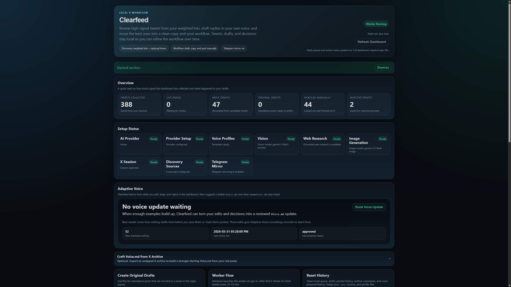

# Clearfeed: AI X/Twitter Feed Curator & Drafter


Local X/Twitter dashboard for finding high-signal posts, drafting replies in your voice, and keeping up without getting trapped in the feed.

Clearfeed watches your weighted X/Twitter Lists and optional home timeline, ranks the strongest posts, and helps you turn the right ones into replies or original posts without handing the whole workflow over to AI.

It works with either Google Vertex or any OpenAI-compatible endpoint, so you can run it against hosted models or local servers like Ollama, LM Studio, and vLLM.

## Why This Exists
- Most feeds are noisy.
- Most good posts disappear into timeline clutter.
- Most AI writing tools help you publish more, not think better.

I built Clearfeed because I wanted a better way to keep up with X/Twitter, spot posts worth replying to, and stay close to what smart people were talking about without falling into endless scrolling.

The point is simple: tighter inputs, better drafting, and a workflow where the human still decides what is worth saying.

## Feature Highlights
- Weighted discovery across multiple X Lists.
- Optional home timeline scraping as an extra signal source.
- Local dashboard for ranking, reviewing, and drafting.
- Voice-aware drafting using your own local `WhoAmI.md`, `Voice.md`, and `Humanizer.md`.
- Provider-agnostic AI setup: Vertex or OpenAI-compatible endpoints.
- Local voice memory that learns from kept, rejected, and dashboard-edited drafts.
- Archive import that can bootstrap a stronger `Voice.md` from your real X history.
- Adaptive Voice suggestions that improve `Voice.md` from your real decisions over time.
- AI-assisted profile setup with questionnaire templates and prompt packs.
- Editable drafts so you can replace or steer the AI instead of accepting whatever it generated.
- Batch original-post drafting with suggested posting slots across the day.
- Optional live web-grounded research for original-post batches on providers that support it.
- Copy-first manual posting workflow.
- Optional Telegram access through the tunneled Mini App.

## Dashboard Preview


## Feature Demos
### Full Dashboard Tour
One scroll through the full local workflow, from the overview and reply queue to original drafts and Adaptive Voice.


### Generate Tweet
Import a tweet link directly into the queue and generate a reply draft without posting anything to X.


### Original Prompt
Write a custom original-post brief and generate a standalone draft from the dashboard.


### Adaptive Voice
Review the Adaptive Voice section and the proposed `Voice.md` update before deciding whether to apply it.


## What Clearfeed Helps With
- Keeping up with your niche without sitting in the home feed for hours.
- Finding posts that are actually worth replying to.
- Turning rough ideas into reply drafts in your own voice.
- Editing before posting so AI stays useful instead of taking over.
- Letting Adaptive Voice learn from what you keep, reject, and rewrite.

## Why It's Different
- Better inputs first. The core job is filtering the feed, not just generating text.
- Human-in-the-loop by default. You edit, copy, reject, or post manually.
- Voice improves from real decisions over time instead of staying static.
- Local-first setup keeps your workflow, profile files, and review history on your machine.
- You can run it on hosted models or local OpenAI-compatible servers instead of being locked into one vendor.

## Example Use Case
You follow AI builders, startup founders, and infra researchers across a few lists. Clearfeed watches those sources, ranks the posts most worth your attention, helps you draft a reply in your voice, and learns from what you edit or reject so the next draft is closer to how you would actually say it.

## How It Works
1. You choose the feeds that matter: list 1, list 2, list 3, and optional home timeline.
2. Each source gets its own weight.
3. The worker scrapes recent posts, scores them, and pushes the best candidates into the local dashboard.
4. You draft a reply, quote reply, or original post in your own voice.
5. You edit in the dashboard, copy the final draft to X, and mark it manual when you're done.
6. The app saves those decisions locally and lets Adaptive Voice propose better `Voice.md` updates over time.

## Who This Is For
- Builders who actively post on X/Twitter.
- Founders who want a cleaner signal feed than the default timeline.
- Operators who want AI to help with drafting, not replace judgment.
- People who want to learn from relevant posts without spending hours scrolling.

## Quickstart
```powershell
git clone https://github.com/YashSerai/clearfeed-twitter-x-dashboard.git "Clearfeed Twitter X Dashboard"
cd "Clearfeed Twitter X Dashboard"
.\scripts\bootstrap.ps1
.\scripts\setup.ps1
```

`setup.ps1` asks which AI provider you want to use and scaffolds the relevant env keys for that path.
If `.env` already exists, it updates provider-related keys in place rather than replacing the whole file, but you should still back up one-time secrets before rerunning setup.

Then:
1. Fill in `.env`.
   If you want stronger standalone posts than replies, set `AI_ORIGINALS_MODEL` to a premium model and tune `WORKER_ORIGINAL_POST_OPTIONS` / `WORKER_MAX_ORIGINAL_DRAFTS_PER_DAY`.
2. Build `profiles/local/WhoAmI.md`.
3. Build `profiles/local/Voice.md`.
4. Review `profiles/local/Humanizer.md`.
5. Add your feed URLs and weights in `.env` or `data/sources/x_sources.yaml`.
6. Optionally set `HOME_TIMELINE_ENABLED=true`.
7. Save a logged-in X session:

```powershell
.\scripts\capture-x-session.ps1
```

8. Start the dashboard:

```powershell
.\scripts\run-dashboard.ps1
```

Then open [http://127.0.0.1:8787/](http://127.0.0.1:8787/).

9. In a second terminal, start the worker:

```powershell
.\scripts\run-worker.ps1
```

10. Optional: enable Telegram access on your phone or another network.
Choose `Telegram Mini App with automatic tunnel` during `.\scripts\setup.ps1`.
Setup now:
- prompts for `TELEGRAM_BOT_TOKEN`
- prompts for `TELEGRAM_CHAT_ID`
- tries to install `cloudflared`
- tries to launch the quick tunnel immediately so `.env` gets a usable `PUBLIC_BASE_URL`

Then `.\scripts\start_services.ps1` will:
- start a Cloudflare quick tunnel automatically
- refresh `PUBLIC_BASE_URL` automatically
- start the dashboard and worker with that tunneled URL
- let Telegram open the same Clearfeed workflow through the Mini App

If setup already populated `PUBLIC_BASE_URL`, it also prints the exact Mini App link to use in BotFather or manual Telegram bot setup:
- `https://your-public-url/mini`

Telegram uses the same local app and database as the desktop dashboard:
- desktop dashboard: `http://127.0.0.1:8787/`
- local Mini App page: `http://127.0.0.1:8787/mini`
- remote Telegram access: `PUBLIC_BASE_URL/mini`

Legacy Telegram forwarding is disabled by default. Telegram is for opening Clearfeed, not for mirroring draft and post-status messages.

## Common Commands
```powershell
.\scripts\run-dashboard.ps1
.\scripts\run-worker.ps1
.\scripts\start_services.ps1
.\scripts\stop_services.ps1
.\scripts\stop_all_services.ps1
.\scripts\import-x-archive.ps1 -ArchiveDir "C:\path\to\unzipped\twitter-archive"
```

The dashboard runs locally at [http://127.0.0.1:8787/](http://127.0.0.1:8787/).

## Detailed Setup
The full setup guide lives in [docs/setup-guide.md](docs/setup-guide.md). It covers:
- requirements
- common commands
- provider setup
- source configuration
- voice setup
- archive import
- manual posting workflow
- voice evolution
- troubleshooting

## Repo Layout
- `clearfeed_dashboard/` application code
- `scripts/` bootstrap and runtime commands
- `profiles/default/` starter profile templates tracked in git
- `profiles/local/` your live profile files, ignored by git
- `profiles/templates/` questionnaire and AI prompt templates
- `data/sources/x_sources.yaml` feed config
- `docs/assets/` screenshots, GIFs, and social preview assets
- `docs/launch-checklist.md` release checklist

## Contributing
If you want to improve the source ranking, dashboard UX, or onboarding flow, open an issue first with:
- the problem you hit
- the behavior you expected
- the smallest change that would improve it

## Notes
- This project uses Playwright for local discovery. You are responsible for complying with X rules, your account setup, and any applicable platform restrictions.
- Home timeline scraping is optional and disabled by default.
- Clearfeed is intentionally draft-first and manual-post only.
- This project is designed for human-assisted workflows, not unattended automation.
- Local models are supported through the OpenAI-compatible path, but stronger hosted models usually produce better archive-to-voice proposals and cleaner Adaptive Voice updates.

## About the Developer
I built Clearfeed because I was tired of how noisy X had become. Too much scroll. Too little signal. I wanted something that helped me keep up with smart people, find posts actually worth replying to, and stay in the loop without living in the feed.

I'm Yash Serai, a Vancouver-based software engineer, data engineer, and solo technical founder. Most of what I care about sits somewhere between product systems, AI, and user behavior. I like building tools that feel practical and sharp, not bloated, and I care a lot about software that helps people think more clearly instead of just consume more.

If this repo is interesting to you, check out my other work on my [GitHub profile](https://github.com/YashSerai).
